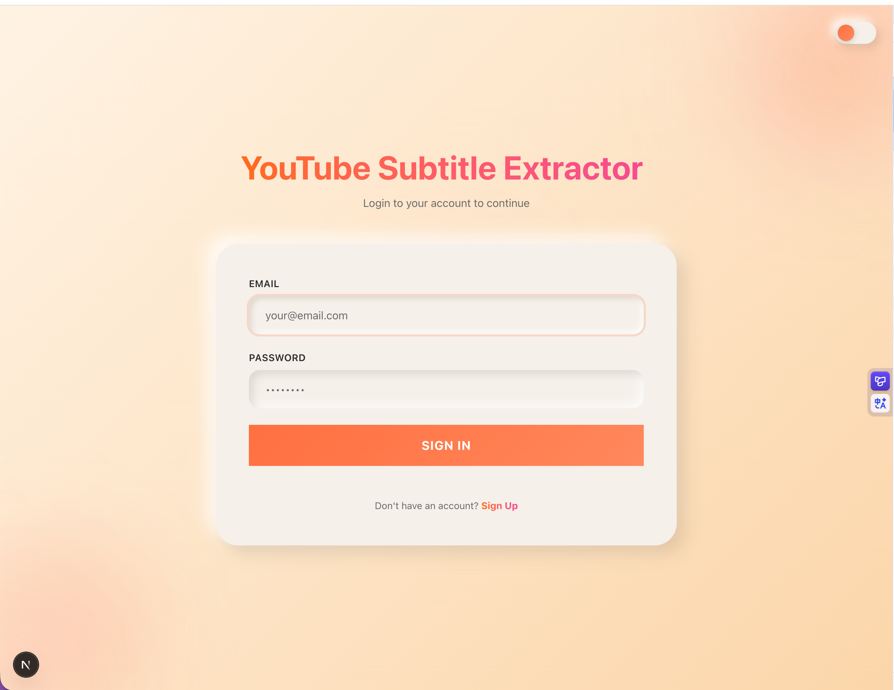
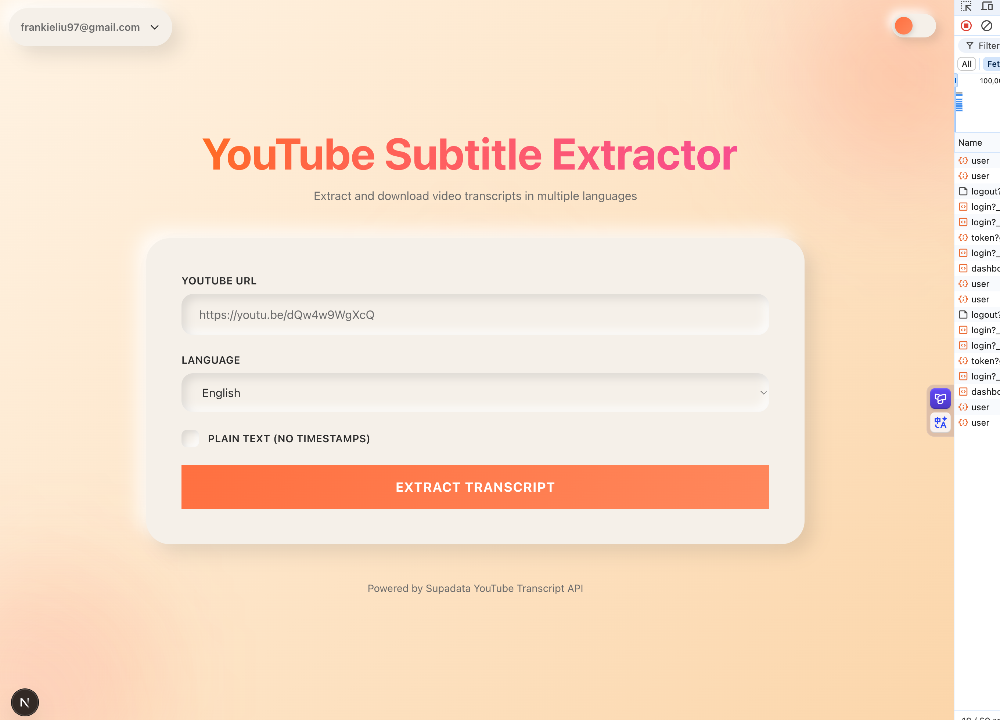
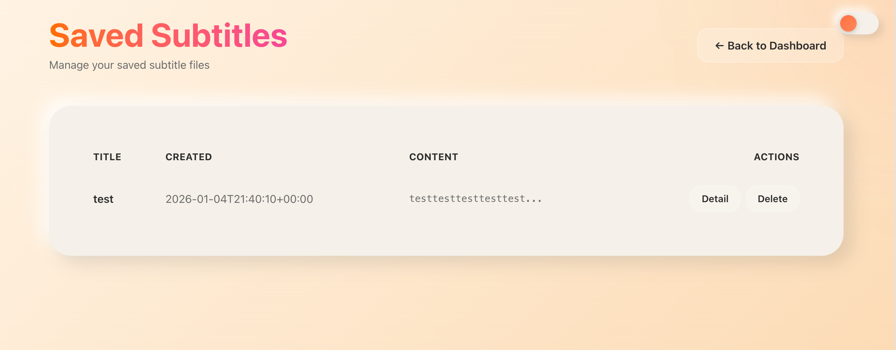
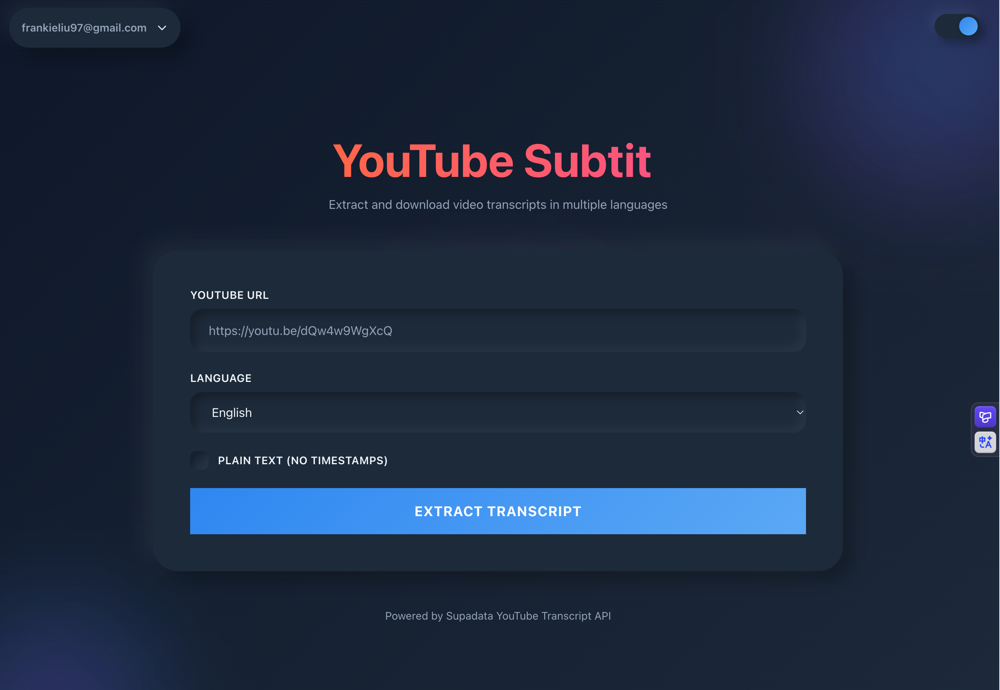

# YouTube Subtitle Extractor

<div align="center">


A modern, feature-rich web application for extracting, managing, and downloading YouTube video subtitles with support for multiple languages.

[Features](#features) • [Demo](#demo) • [Installation](#installation) • [Tech Stack](#tech-stack) • [API](#api-documentation) • [Database](#database-schema)

</div>

---

## 📋 Table of Contents

- [Overview](#overview)
- [Features](#features)
- [Screenshots](#screenshots)
- [Tech Stack](#tech-stack)
- [Getting Started](#getting-started)
- [Database Schema](#database-schema)
- [API Documentation](#api-documentation)
- [UI/UX Design](#uiux-design)
- [Environment Variables](#environment-variables)
- [Project Structure](#project-structure)
- [Contributing](#contributing)
- [License](#license)

---

## 🎯 Overview

YouTube Subtitle Extractor is a full-stack web application that allows users to extract subtitles from YouTube videos in multiple languages. Built with Next.js 16 and powered by Supabase, it features a modern neumorphic/glassmorphic design with dark mode support and intelligent theme detection.

### Key Highlights

- 🎬 Extract subtitles from any YouTube video
- 🌍 Support for multiple languages
- 💾 Save and manage subtitle collections
- 📥 Download subtitles in plain text or timestamped format
- 🎨 Beautiful neumorphic UI with glassmorphism effects
- 🌓 Auto-follow system dark mode with manual override
- ⚡ Real-time typewriter animation effects
- 🔐 Secure authentication with Supabase
- 📱 Fully responsive design

---

## ✨ Features

### Core Functionality

- **YouTube Subtitle Extraction**

  - Extract subtitles from any public YouTube video
  - Support for 100+ languages
  - Auto-detect available subtitle languages
  - Choose between plain text or timestamped format

- **Subtitle Management**

  - Save extracted subtitles with custom titles
  - View all saved subtitles in a organized table
  - Preview subtitle content (first 20 characters)
  - View full subtitle details in modal
  - Copy subtitles to clipboard
  - Delete subtitles with confirmation

- **User Authentication**
  - Secure email/password authentication
  - User registration and login
  - Protected routes with middleware
  - Session management
  - Logout functionality

### UI/UX Features

- **Modern Design System**

  - Neumorphic cards with soft shadows
  - Glassmorphism buttons with backdrop blur
  - Smooth transitions and animations
  - Gradient text effects
  - Hover effects and micro-interactions

- **Theme System**

  - Auto-detect and follow system dark mode
  - Manual theme toggle
  - Theme persists during login session
  - Resets to system preference on logout
  - Animated background with floating gradient orbs

- **Typewriter Effect**

  - Character-by-character title animation
  - Blinking cursor effect
  - Auto-loop with deletion animation
  - Configurable speed and delay

- **Responsive Design**
  - Mobile-first approach
  - Tablet and desktop optimized
  - Adaptive layouts
  - Touch-friendly interactions

---

## 📸 Screenshots

### Login Page


_Clean login interface with typewriter animation and animated background_

### Dashboard


_Main dashboard for extracting YouTube subtitles_

### Subtitle List


_Manage and view all saved subtitles_

### Dark Mode


_Beautiful dark mode with blue/purple gradient theme_

---

## 🛠 Tech Stack

### Frontend

| Technology          | Version | Purpose                         |
| ------------------- | ------- | ------------------------------- |
| **Next.js**         | 16.1.1  | React framework with App Router |
| **React**           | 19.2.3  | UI library                      |
| **TypeScript**      | 5.0+    | Type safety                     |
| **Tailwind CSS**    | 4.0     | Utility-first CSS framework     |
| **React Hook Form** | 7.69.0  | Form management                 |
| **Zod**             | 4.3.4   | Schema validation               |

### Backend & Database

| Technology                        | Version | Purpose                              |
| --------------------------------- | ------- | ------------------------------------ |
| **Supabase**                      | 2.89.0  | Authentication & PostgreSQL database |
| **@supabase/ssr**                 | 0.8.0   | Server-side rendering support        |
| **@supabase/auth-helpers-nextjs** | 0.15.0  | Next.js auth integration             |

### Development Tools

- **ESLint** - Code linting
- **PostCSS** - CSS processing
- **TypeScript** - Static type checking

---

## 🚀 Getting Started

### Prerequisites

- Node.js 20.9.0 or higher
- npm, yarn, pnpm, or bun
- Supabase account

### Installation

1. **Clone the repository**

   ```bash
   git clone https://github.com/yourusername/youtube-subtitle-tool.git
   cd youtube-subtitle-tool
   ```

2. **Install dependencies**

   ```bash
   npm install
   # or
   yarn install
   # or
   pnpm install
   ```

3. **Set up environment variables**

   Create a `.env.local` file in the root directory:

   ```env
   NEXT_PUBLIC_SUPABASE_URL=your_supabase_project_url
   NEXT_PUBLIC_SUPABASE_ANON_KEY=your_supabase_anon_key
   ```

4. **Set up Supabase database**

   Run the following SQL in your Supabase SQL editor:

   ```sql
   -- Create subtitles table
   CREATE TABLE subtitles (
     id BIGSERIAL PRIMARY KEY,
     user_id UUID NOT NULL,
     title TEXT NOT NULL,
     content TEXT NOT NULL,
     created_at DATE NOT NULL DEFAULT CURRENT_DATE
   );

   -- Add index for faster queries
   CREATE INDEX idx_subtitles_user_id ON subtitles(user_id);

   -- Enable Row Level Security
   ALTER TABLE subtitles ENABLE ROW LEVEL SECURITY;

   -- Create policy for users to access only their own subtitles
   CREATE POLICY "Users can view their own subtitles"
     ON subtitles FOR SELECT
     USING (auth.uid() = user_id);

   CREATE POLICY "Users can insert their own subtitles"
     ON subtitles FOR INSERT
     WITH CHECK (auth.uid() = user_id);

   CREATE POLICY "Users can delete their own subtitles"
     ON subtitles FOR DELETE
     USING (auth.uid() = user_id);
   ```

5. **Run the development server**

   ```bash
   npm run dev
   # or
   yarn dev
   # or
   pnpm dev
   ```

6. **Open your browser**

   Navigate to [http://localhost:3000](http://localhost:3000)

### Building for Production

```bash
npm run build
npm run start
```

---

## 🗄 Database Schema

### Subtitles Table

| Column       | Type      | Constraints                    | Description                         |
| ------------ | --------- | ------------------------------ | ----------------------------------- |
| `id`         | BIGSERIAL | PRIMARY KEY                    | Auto-incrementing unique identifier |
| `user_id`    | UUID      | NOT NULL                       | Foreign key to Supabase auth.users  |
| `title`      | TEXT      | NOT NULL                       | User-defined subtitle title         |
| `content`    | TEXT      | NOT NULL                       | Full subtitle content               |
| `created_at` | DATE      | NOT NULL, DEFAULT CURRENT_DATE | Creation date (YYYY-MM-DD)          |

### Indexes

- `idx_subtitles_user_id` - B-tree index on `user_id` for faster user-specific queries

### Row Level Security (RLS)

All subtitle operations are protected by RLS policies:

- Users can only view their own subtitles
- Users can only insert subtitles for themselves
- Users can only delete their own subtitles

---

## 📡 API Documentation

### Authentication

All API routes (except public pages) require authentication via Supabase session cookies.

### Endpoints

#### 1. Get Subtitles

**GET** `/api/subtitles`

Fetch all subtitles for the authenticated user.

**Headers:**

```
Cookie: sb-<project-ref>-auth-token=<session-token>
```

**Response:**

```json
{
  "subtitles": [
    {
      "id": 1,
      "user_id": "uuid",
      "title": "My Video Subtitle",
      "content": "Full subtitle text...",
      "created_at": "2026-01-04"
    }
  ]
}
```

**Status Codes:**

- `200` - Success
- `401` - Unauthorized (not logged in)
- `500` - Server error

---

#### 2. Save Subtitle

**POST** `/api/subtitles`

Save a new subtitle for the authenticated user.

**Headers:**

```
Content-Type: application/json
Cookie: sb-<project-ref>-auth-token=<session-token>
```

**Request Body:**

```json
{
  "title": "My Video Subtitle",
  "content": "Full subtitle text with timestamps..."
}
```

**Response:**

```json
{
  "subtitle": {
    "id": 1,
    "user_id": "uuid",
    "title": "My Video Subtitle",
    "content": "Full subtitle text...",
    "created_at": "2026-01-04"
  }
}
```

**Status Codes:**

- `201` - Created successfully
- `400` - Bad request (missing title or content)
- `401` - Unauthorized
- `500` - Server error

---

#### 3. Delete Subtitle

**DELETE** `/api/subtitles/[id]`

Delete a specific subtitle by ID.

**Headers:**

```
Cookie: sb-<project-ref>-auth-token=<session-token>
```

**URL Parameters:**

- `id` - Subtitle ID (integer)

**Response:**

```json
{
  "success": true
}
```

**Status Codes:**

- `200` - Deleted successfully
- `400` - Bad request (missing ID)
- `401` - Unauthorized
- `403` - Forbidden (not owner)
- `404` - Subtitle not found
- `500` - Server error

---

#### 4. Extract Transcript

**POST** `/api/transcript`

Extract subtitles from a YouTube video.

**Request Body:**

```json
{
  "url": "https://www.youtube.com/watch?v=VIDEO_ID",
  "lang": "en",
  "text": true
}
```

**Parameters:**

- `url` (string, required) - YouTube video URL
- `lang` (string, optional) - Language code (default: "en")
- `text` (boolean, optional) - Return plain text (true) or timestamped (false)

**Response (Plain Text):**

```json
{
  "text": "Full subtitle text without timestamps..."
}
```

**Response (Timestamped):**

```json
{
  "transcript": [
    {
      "text": "Hello world",
      "start": 0,
      "duration": 2000
    }
  ]
}
```

**Status Codes:**

- `200` - Success
- `400` - Bad request (invalid URL)
- `404` - Subtitles not available
- `500` - Server error

---

## 🎨 UI/UX Design

### Design System

#### Color Palette

**Light Mode:**

- Background: `#fef3e2` → `#fad6a5` (gradient)
- Card: `#f0e6d2`
- Text: `#2c2416`
- Accent: Orange (`#ff6b35`) to Pink (`#ff69b4`)

**Dark Mode:**

- Background: `#0f172a` → `#1e293b` (gradient)
- Card: `#1e293b`
- Text: `#e2e8f0`
- Accent: Blue (`#3b82f6`) to Purple (`#9333ea`)

#### Typography

- **Headings:** Bold, uppercase tracking, gradient text
- **Body:** System font stack for optimal readability
- **Monospace:** For subtitle content preview

#### Components

**Neumorphic Cards:**

```css
box-shadow: 12px 12px 24px rgba(0, 0, 0, 0.1), -12px -12px 24px rgba(255, 255, 255, 0.5);
border-radius: 24px;
```

**Glassmorphism Buttons:**

```css
background: rgba(255, 255, 255, 0.1);
backdrop-filter: blur(10px);
border: 1px solid rgba(255, 255, 255, 0.2);
```

**Animated Background:**

- 3 floating gradient orbs
- Smooth movement with scale animation
- 20s, 25s, 30s loop durations
- 60px Gaussian blur

### Animations

- **Typewriter Effect:** 150ms per character, 3s pause, auto-loop
- **Cursor Blink:** 0.8s ease-in-out infinite
- **Hover Effects:** 0.3s smooth transitions
- **Page Transitions:** Fade and slide animations

---

## 🔐 Environment Variables

Create a `.env.local` file with the following variables:

```env
# Supabase Configuration
NEXT_PUBLIC_SUPABASE_URL=https://your-project.supabase.co
NEXT_PUBLIC_SUPABASE_ANON_KEY=your-anon-key
```

### Getting Supabase Credentials

1. Go to [Supabase Dashboard](https://app.supabase.com)
2. Select your project
3. Navigate to Settings → API
4. Copy the Project URL and anon/public key

---

## 📁 Project Structure

```
youtube-subtitle-tool/
├── src/
│   ├── app/                      # Next.js App Router
│   │   ├── api/                  # API routes
│   │   │   ├── subtitles/        # Subtitle CRUD endpoints
│   │   │   └── transcript/       # YouTube transcript extraction
│   │   ├── dashboard/            # Dashboard page
│   │   ├── login/                # Login page
│   │   ├── register/             # Registration page
│   │   ├── subtitles/            # Subtitle list page
│   │   ├── globals.css           # Global styles
│   │   ├── layout.tsx            # Root layout
│   │   └── page.tsx              # Home page
│   ├── components/               # React components
│   │   ├── AnimatedBackground.tsx
│   │   ├── SaveDialog.tsx
│   │   ├── SubtitleDetailModal.tsx
│   │   ├── TypewriterText.tsx
│   │   └── UserDropdown.tsx
│   ├── hooks/                    # Custom React hooks
│   │   └── useSystemTheme.ts     # Theme management hook
│   ├── lib/                      # Utility libraries
│   │   ├── supabase.ts           # Supabase client factory
│   │   └── supabase-client.ts    # Browser Supabase client
│   ├── types/                    # TypeScript types
│   │   └── types.ts              # Shared type definitions
│   └── middleware.ts             # Next.js middleware (auth)
├── public/                       # Static assets
├── .env.local                    # Environment variables (not in repo)
├── next.config.ts                # Next.js configuration
├── package.json                  # Dependencies
├── tsconfig.json                 # TypeScript configuration
└── README.md                     # This file
```

---

## 🤝 Contributing

Contributions are welcome! Please follow these steps:

1. Fork the repository
2. Create a feature branch (`git checkout -b feature/AmazingFeature`)
3. Commit your changes (`git commit -m 'Add some AmazingFeature'`)
4. Push to the branch (`git push origin feature/AmazingFeature`)
5. Open a Pull Request

### Development Guidelines

- Follow the existing code style
- Write meaningful commit messages
- Add comments for complex logic
- Test your changes thoroughly
- Update documentation as needed

---

## 📄 License

This project is licensed under the MIT License - see the [LICENSE](LICENSE) file for details.

---

## 🙏 Acknowledgments

- [Next.js](https://nextjs.org/) - The React Framework
- [Supabase](https://supabase.com/) - Open source Firebase alternative
- [Tailwind CSS](https://tailwindcss.com/) - Utility-first CSS framework
- [React Hook Form](https://react-hook-form.com/) - Performant form library
- YouTube Transcript API - For subtitle extraction

---

## 📞 Contact

For questions or support, please open an issue on GitHub.

---

<div align="center">

Made with ❤️ using Next.js and Supabase

⭐ Star this repo if you find it helpful!

</div>
